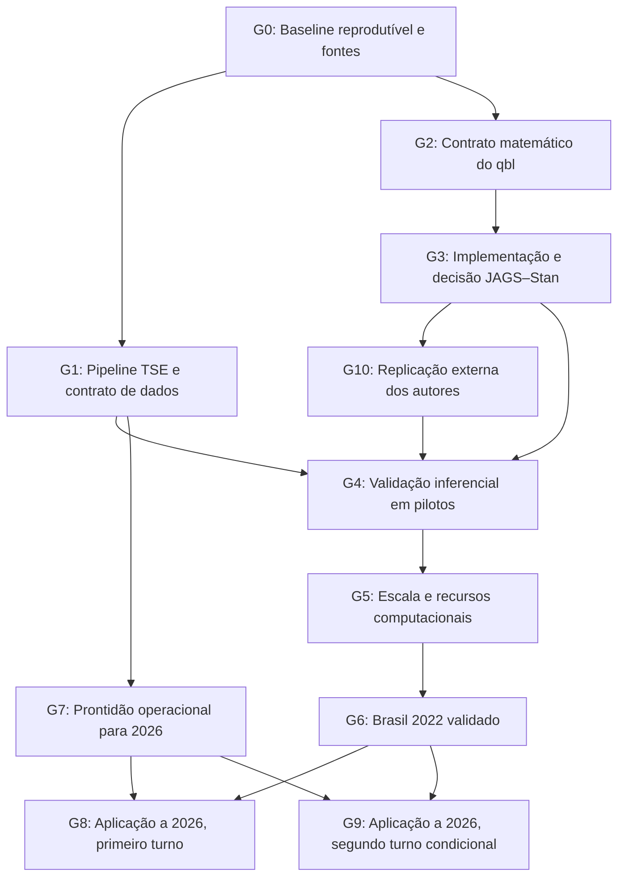

# Gates Mebane: Brasil 2022 e 2026

Gerado de `mebane_2022_2026_gates.json`; editar o ledger e renderizar novamente.

Data: 2026-09-28

Modelo eforensics qbl para eleição presidencial brasileira de 2022 e preparação para 2026, com execução por subagentes, goals delimitados e revisão independente.

Primeiro estudo experimental A/D em D.C.2010 concluído, mantendo A literal intacta e D multinomial separada. Mesmas 143 unidades, JAGS em ambos, quatro cadeias e 2000 amostras retidas por cadeia. Ambos computacionalmente inconclusivos: R-hat global máximo A=3.451/D=2.472, ESS bulk mínimo A=4.41/D=4.84; geração+diagnóstico A=124.92s/D=89.97s. Revisão independente e adjudicação aprovaram fidelidade da entrega, não precisão posterior. PDF, fontes e handoff em coordination/2026-09-30_ad_study sob resultados dos gates. Próxima investigação proposta: mistura das cadeias e tradução exata de D para Stan, antes de escalar. G2 histórico preservado, G3 inconclusive, G10 pendente e sem engine de produção ou inferência brasileira aprovadas. O estudo não substitui referência numérica externa dos autores. Nenhuma exclusão ou instalação autorizada.

## Coordenação e modelos

Agente principal desta conversa: despacha, acompanha, adjudica achados e autoriza transições técnicas com base em evidências.

- **basis**: Heurística conservadora, sem benchmark comparativo de qualidade ou velocidade entre modelos neste projeto.
- **catalog**: Catálogo vivo de multi_agent_v1__spawn_agent consultado em 2026-09-28. O script adaptive-codex-router ainda usa a família 5.6; sua recomendação de modelos não é aplicada literalmente à família 6.
- **sol**: GPT-6 Sol executa inventário, pipelines, testes, diagnósticos, benchmarks e geração de resultados. Para matemática ou inferência, pode preparar código e verificações, mas a aprovação requer revisor separado no modelo principal.
- **principal**: O modelo principal é herdado, sem afirmar um identificador que o runtime não informou. Assume desenho matemático difícil, adjudicação e revisão metodológica de alto impacto.
- **speed**: Sem solicitação de tier Fast. O tool de subagentes não expõe controle de tier; não inferir velocidade efetiva.
- **escalation**: Corrigir a parte que falhou; elevar esforço Sol high para xhigh quando pertinente; transferir a parte ambígua ao modelo principal se persistir falha substantiva. Toda revisão deve ser feita por agente que não escreveu o artefato.

## Sequência

| Gate | Executor | Revisor independente | Estado |
|---|---|---|---|
| G0 | gpt-6-sol / high | gpt-6-sol / high | pass |
| G1 | gpt-6-sol / high | gpt-6-sol / xhigh | pass |
| G2 | inherit / xhigh | inherit / xhigh | pass |
| G3 | gpt-6-sol / xhigh | inherit / xhigh | inconclusive |
| G10 | gpt-6-sol / xhigh | inherit / xhigh | queued |
| G4 | gpt-6-sol / xhigh | inherit / xhigh | queued |
| G5 | gpt-6-sol / high | gpt-6-sol / xhigh | queued |
| G6 | gpt-6-sol / high | inherit / xhigh | queued |
| G7 | gpt-6-sol / high | gpt-6-sol / xhigh | pass |
| G8 | gpt-6-sol / high | inherit / xhigh | waiting_external |
| G9 | gpt-6-sol / high | inherit / xhigh | waiting_external |

`inherit` = modelo principal herdado pelo subagente.

G7 pass: recepção e validação de arquivos estão ensaiadas com fixtures. Não implica estimativas de 2026.
G6 e G7 pass, com modelo/configuração aprovados e transferibilidade avaliada. G8 libera apenas T1, G9 apenas T2; cada qual exige dados oficiais e revisão própria. G8 pass/G9 waiting_external, G8 pass/G9 inconclusive e G9 not_applicable são estados distintos e preservados.
G0 -> G1 -> G7 em paralelo a G0 -> G2 -> G3 -> G10 -> G4. G10 tem numeração nova, mas precede G4 por dependência. Datas oficiais não são promessa de duração dos gates inferenciais.

## Regras de operação

- Cada execução de gate tem um subagente executor com goal nativo delimitado à entrega do candidato; a checagem usa outro subagente e outro goal. Não criar orçamento de tokens sem pedido explícito do usuário.
- O coordenador chama get_goal/create_goal para sua própria tarefa de coordenação. Os subagentes verificam seu próprio contexto antes de criar goals; se o recurso não existir, registram a limitação sem simular um goal nativo.
- A conclusão do goal do executor significa entrega para revisão. Somente o coordenador muda o gate para pass após evidência independente e adjudicação. O goal do revisor é emitir um parecer completo, inclusive quando encontrar falhas.
- O estado nativo blocked exige a recorrência prevista pelo tool. Dependência pendente no plano não autoriza marcar imediatamente um goal nativo como blocked; o gate fica queued ou waiting_external e o coordenador trabalha em outro ramo.
- Revisão independente usa agente novo, sem herdar a conversa do implementador. Recebe o contrato congelado, fontes e hashes dos artefatos, reproduz verificações relevantes e busca contraexemplos; autoavaliação não basta.
- Só existe um escritor por arquivo. Subagentes recebem write_scope explícito; revisão não modifica o candidato. A concorrência inicial é de até dois executores com arquivos disjuntos e um revisor.
- Mudança material em contrato, estimando, critérios, dependências, condição externa, entrada, código ou configuração após o congelamento invalida o parecer correspondente e reabre o gate e seus dependentes afetados. O contrato estático exclui somente status/records do gate e status/evidence dos todos; seu SHA-256 e os hashes das aprovações dos predecessores vinculam a rodada.
- Usar apply_patch para edições manuais, preservar alterações preexistentes e arquivos brutos. O arquivo ssrn-4073770.pdf permanece preservado; o download incompleto da pasta .download permanece ausente por decisão do usuário, com registro histórico. Inventariar sem substituir e conferir integridade antes de usar como fonte.
- Não excluir arquivos ou diretórios sem autorização explícita prévia do usuário, inclusive em limpeza de temporários e tarefas de subagentes. A decisão de manter a ausência do download incompleto não autoriza novas exclusões nem sua restauração. Registrar remoções inesperadas sem atribuir autoria sem evidência.
- O pedido atual inclui 2026 e prevalece sobre o escopo antigo de CLAUDE.md. Alegações históricas de convergência ou confirmação da nula devem ser conferidas nos artefatos, não usadas como critérios de aprovação.
- Sem instalações ou atualizações fora da autorização já dada. Reutilizar o ambiente; se faltar dependência, apresentar item e necessidade exatos, respeitando autorizações anteriores no mesmo escopo.
- Não executar tarefas nacionais longas antes do gate de recursos. Nenhuma troca silenciosa de qbl por bl, aproximação contínua, estimação por UF ou amostragem substitui o alvo aprovado.
- Processos longos usam logs persistentes, IDs de execução e checkpoints possíveis. O coordenador não declara monitoramento futuro sem mecanismo ativo nem cria automação apenas por haver dependência futura.
- Resultados eleitorais de 2026 dependem de publicação oficial. Dados e código podem ser preparados antes; a espera não deve manter um subagente ocioso ou um goal impossível de concluir ativo indefinidamente.
- G8 e G9 representam respectivamente T1 e T2 de 2026, com estados/goals próprios. Cada versão oficial usa diretório imutável ano/turno/SHA-do-snapshot/roundN; reestimação por retificação preserva o records da versão anterior. Não existe aprovação conjunta implícita de 2026.
- G9 pode ser not_applicable somente após atestação oficial independente de que T2 não ocorreu. Dados ausentes ou ainda não publicados exigem waiting_external, nunca not_applicable. Um goal finito verifica a ocorrência; esse desfecho não marca todos analíticos como executados.
- G10 reproduz ao menos um resultado empírico dos próprios autores do eforensics, com artigo/versão e alvo numérico identificados, dados e código arquivados, critérios congelados e revisão independente antes da nova execução. Exemplo sintético ou pacote de terceiros sobre Brasil não substitui esse requisito. A busca preparatória pode ocorrer antes de G3, mas não é G10 pass.
- Replicação externa bem-sucedida verifica implementação no caso reproduzido, não identificação ou validade eleitoral no Brasil. Divergência de versão/modelo deve ser rotulada; não ajustar critérios ou trocar de caso depois de observar fracasso sem preservar e justificar a decisão.

## Contrato de evidência

- run.json: gate_id, round, contract_sha256, dependency_manifests, executor_id, IDs dos goals quando disponíveis, modelo solicitado, esforço, início/fim, comandos, sementes, versões, exit codes, tempos e paths de inputs/code/configuration/outputs efetivamente usados.
- candidate_manifest.json: SHA-256 dos arquivos de código, configuração, dados usados e saídas; tamanhos e caminhos. Documentar inputs ausentes ou excluídos, sem fingir snapshot completo.
- Todos: cada item done inclui localizador da evidência e sua origem: inspecionado, executado agora ou histórico. Uma alegação de agente não é evidência independente.
- review.json/review.md: reviewer_id canônico diferente de executor_id, gate_id, round, contract_sha256, candidate_manifest_sha256 revisado, atestação manifest_complete após inspeção, testes independentes e findings identificados. Pass só com todos os critérios atendidos e sem falha material não resolvida.
- adjudication.json/adjudication.md: vínculo ao gate/round/contrato/manifesto e review_sha256; todos os achados classificados CONFIRMED, PARTIAL, REFUTED ou UNRESOLVED, com evidência localizável, reparo delimitado e resolução conferida. Não aprovar por média de notas.
- O contrato estático tem snapshot próprio no manifesto; run e todos os caminhos declarados entram no manifesto. O revisor atesta completude após conferir a execução. O checker não descobre dependências não declaradas nem prova oficialidade pelo domínio de uma URL.
- O ledger contém referências aos artefatos aprovados. Um campo pass preenchido não substitui leitura e reprodução pelo coordenador.

## G0: Baseline reprodutível e fontes

**Goal:** Entregar inventário verificável de dados, documentos, código, fits e ambiente, distinguindo execução histórica de validação atual e tornando possível reproduzir o baseline.

**Dependências:** nenhuma.
**Estado:** `pass`.

**Escrita exclusiva:** `quality_reports/results/mebane_gates/G0/`, `renv.lock`, `README.md`, `CLAUDE.md`.

### Todos do goal

- [x] **G0-T1**: Inventariar Git, arquivos brutos/processados, fits, logs e PDFs; registrar integridade, hashes e proveniência sem alterar os originais.
- [x] **G0-T2**: Extrair versões efetivas de R, pacotes, JAGS e CmdStan e o commit de eforensics; reconciliar renv.lock com os componentes usados sem atualizar o ambiente silenciosamente.
- [x] **G0-T3**: Reconciliar README/CLAUDE/handoffs com a evidência: registrar falhas JAGS/Stan, a aproximação Stan e a ausência de resultado nacional, mantendo os logs históricos.
- [x] **G0-T4**: Fixar fontes bibliográficas e versão exata do código de referência; testar carregamento não destrutivo dos artefatos necessários e documentar faltantes.

### Entregáveis

- Inventário e manifestos de fontes/ambiente
- Lockfile reconciliado
- Mapa de alegações históricas versus evidência

### Aceitação independente

- Todo artefato usado nos próximos gates tem versão e proveniência identificáveis.
- Artefatos em download/incompletos não são tratados como fontes válidas.
- Restauração do ambiente é verificável com o material disponível; dependência ausente permanece explícita e impede alegar reprodução completa.
- QA recalcula hashes de uma amostra material, verifica o commit do pacote e carrega ao menos um fit e um conjunto de dados necessários.

**Se falhar:** Corrigir inventário ou dependência faltante; preservar o estado existente. Trabalho documental independente pode continuar.

## G1: Pipeline TSE e contrato de dados

**Goal:** Construir uma entrada parametrizada por ano, turno, cargo e candidato, reproduzindo os totais de 2022 e explicitando todas as regras de limpeza necessárias ao modelo.

**Dependências:** G0.
**Estado:** `pass`.

**Escrita exclusiva:** `R/01_load_tse.R`, `R/02_build_vars.R`, `R/lib/mebane_data.R`, `config/mebane/`, `tests/mebane/data/`, `quality_reports/results/mebane_gates/G1/`.

### Todos do goal

- [x] **G1-T1**: Separar configuração de ano/turno/cargo/candidato dos scripts e do espelho Nexo específico de 2022; criar saída versionada por execução.
- [x] **G1-T2**: Validar tipos, encoding, chaves com ano/turno, duplicatas, cardinalidades dos joins, ausência versus voto zero e elegibilidade de candidato por turno; rejeitar duplicata divergente sem deduplicar pela primeira ocorrência.
- [x] **G1-T3**: Reconciliar aptos, comparecimento, abstenções, brancos, nulos e votos nominais com totais oficiais; testar limites N/a/w e reavaliar as 99 exclusões por votos nominais zero para o alvo de contagens.
- [x] **G1-T4**: Fixar regras para exterior, seções pequenas, líder nacional por turno, coligações/candidaturas e revisões do TSE; registrar perdas por regra e denominador.
- [x] **G1-T5**: Criar fixtures adversariais e reproduzir 2022 de ponta a ponta com agregações independentes por UF e turno; bloquear totais inconsistentes em vez de corrigi-los silenciosamente.

### Entregáveis

- Loader e configuração genéricos
- Contrato de dados e log de exclusões
- Testes e reconciliação nacional/UF/turno

### Aceitação independente

- Uma execução com a mesma entrada e configuração produz os mesmos totais e chaves.
- Fixtures detectam duplicatas, zeros omitidos, missing, candidato/turno incorreto e mudança incompatível de schema.
- Revisor reproduz totais de controle por código independente, sem consumir apenas a tabela já agregada pelo executor.
- Nenhuma amostra do modelo depende de exclusão pensada somente para gráficos sem justificativa documentada.

**Se falhar:** Suspender estimações que usam a base afetada e corrigir a transformação responsável.

## G2: Contrato matemático do qbl

**Goal:** Estabelecer o alvo estatístico preciso, o que o código JAGS implementa e as diferenças do Stan, com equações, domínios, priors e estimandos verificáveis.

**Dependências:** G0.
**Estado:** `pass`.

**Escrita exclusiva:** `appendices/mebane_model_contract.md`, `tests/mebane/algebra/`, `quality_reports/results/mebane_gates/G2/`.

### Todos do goal

- [x] **G2-T1**: Mapear artigo de 2022, discussão de 2023, qbl do commit fixado e Stan atual linha por linha, distinguindo paper, implementação e aproximação.
- [x] **G2-T2**: Derivar priors induzidas ordenadas, interceptos, efeitos geográficos e hierárquicos; conferir a parametrização JAGS de precisão e a distinção entre variância e desvio-padrão.
- [x] **G2-T3**: Verificar p.a e p.w, suporte físico e probabilístico, contagens binomiais latentes, condicionamentos, truncamentos e o efeito do clamp no Stan em casos de fronteira.
- [x] **G2-T4**: Definir votos manufactured/stolen, classes, totais conjuntos por draw e efeito contrafactual na margem; explicitar que a origem dos votos stolen pode exigir hipóteses adicionais ou limites de identificação parcial, pois não-leaders são agregados. Distinguir identificação, convergência e interpretação substantiva.
- [x] **G2-T5**: Derivar a marginalização exata em casos pequenos ou delimitar formalmente a aproximação e o custo; obter rederivação independente com contraexemplos.

### Entregáveis

- Contrato matemático e tabela de diferenças
- Testes de identidades e fronteiras
- Definições de estimandos e limitações

### Aceitação independente

- Cada equivalência afirmada tem derivação ou teste pertinente, e cada divergência permanece rotulada.
- O significado de Exp(5) e dos parâmetros de escala corresponde à expressão efetiva no código congelado.
- Suporte, contagens discretas, constantes e transformações das priors são auditados; concordância entre médias não prova equivalência.
- Revisor não participante rederiva as partes críticas e não deixa questão material UNRESOLVED.

**Se falhar:** Reparar a derivação ou especificar a decisão substantiva necessária. Sol pode produzir testes auxiliares, mas não substituir a checagem matemática.

## G3: Implementação e decisão JAGS–Stan

**Goal:** Entregar uma implementação testada contra o contrato, e decidir com evidência se a produção usará JAGS, Stan equivalente ou apenas JAGS com Stan aproximado como sensibilidade.

**Dependências:** G2.
**Estado:** `inconclusive`.

**Escrita exclusiva:** `stan/`, `R/lib/mebane_model.R`, `R/05_stan_eforensics_qbl_calibrate.R`, `R/05_eforensics_umeforensics_qbl.R`, `R/07_brasil_full_qbl.R`, `tests/mebane/likelihood/`, `quality_reports/results/mebane_gates/G3/`.

### Todos do goal

- [ ] **G3-T1**: Construir gerador sintético fiel ao contrato, sem reutilizar simulate_bl com constantes incompatíveis sem correção e teste.
- [ ] **G3-T2**: Implementar e testar a verossimilhança de referência para N pequeno, enumerando contagens discretas quando cabível, e comparar probabilidades em uma grade incluindo fronteiras.
- [ ] **G3-T3**: Conferir priors, matrizes de desenho, interface de dados, transformações e generated quantities; testar formula1=w/formula2=a com sentinelas assimétricas e corrigir as chamadas históricas invertidas preservando fonte anterior e fits; separar aproximação já existente de eventual Stan exato e testar gradientes se aplicável.
- [ ] **G3-T4**: Executar comparações pequenas entre engines apenas no mesmo alvo e dentro do erro Monte Carlo; documentar a decisão de engine e a viabilidade da marginalização.

### Entregáveis

- Testes small-N e gerador auditado
- Implementação aprovada ou decisão documentada de manter JAGS
- Registro de equivalência/limites do Stan

### Aceitação independente

- O alvo de produção preserva o contrato G2; aproximações não são apresentadas como portagem exata.
- Uma impossibilidade computacional de Stan exato pode encerrar a opção Stan sem bloquear JAGS validado; a decisão é explícita.
- Tolerâncias numéricas e MCSE são definidas antes da comparação, incluindo casos de suporte inválido.
- Revisor recalcula exemplos da likelihood e identifica a implementação de produção por hash.

**Se falhar:** Corrigir implementação ou voltar ao G2 se o problema for de especificação. Não aumentar iterações para mascarar discrepância de likelihood.

## G10: Replicação externa dos autores

**Goal:** Reproduzir ao menos um resultado empírico publicado pelos próprios autores do eforensics, com dados e código de origem rastreável e comparação previamente especificada, antes de confiar na implementação para o Brasil.

**Dependências:** G3.
**Estado:** `queued`.

**Escrita exclusiva:** `replication_mebane/`, `R/09_replicate_mebane.R`, `R/lib/mebane_author_replication.R`, `config/mebane/replication/`, `tests/mebane/replication/`, `output/mebane/replication/`, `quality_reports/results/mebane_gates/G10/`.

### Todos do goal

- [ ] **G10-T1**: Escolher caso empírico dos autores com artigo/versão/tabela/figura ou células-alvo exatos; arquivar dados, código, ambiente, fontes e resultados de referência com hashes. Distinguir qbl, outras variantes e material de terceiros.
- [ ] **G10-T2**: Fixar replication_contract.json antes de nova estimação: preparação dos dados, unidades, denominadores, fórmulas, priors, versão/modelo, sementes, outputs-alvo, tolerâncias determinísticas e Monte Carlo e regras pass/inconclusive/fail. Obter revisão independente desse contrato antes de G10-T3; falta de MCSE/draws de referência limita o que pode ser atestado.
- [ ] **G10-T3**: Reexecutar o código dos autores em isolamento e reproduzir a saída escolhida; comparar também nossa implementação apenas se o alvo for o mesmo. Registrar qualquer adaptação necessária, tempo, memória, diagnósticos e falhas, sem ajustar o modelo ou critérios para coincidir com a publicação.
- [ ] **G10-T4**: Revisor independente recompõe os resultados centrais a partir dos dados/draws e aplica o contrato congelado. Entregar tabela publicado versus replicado, diferenças, incerteza e limites; separar reprodução de artefatos antigos, nova estimação e validade para o Brasil.

### Entregáveis

- Caso empírico e fontes dos autores arquivados
- Contrato de replicação aprovado antes da execução
- Script de reprodução e tabela publicado versus replicado
- Parecer independente com alcance da reprodução

### Aceitação independente

- Ao menos um alvo empírico publicado pelos próprios autores foi reproduzido; tutorial ou simulação nossa não encerra G10.
- Dados, transformações e especificação correspondem ao resultado-alvo, ou as diferenças permanecem explícitas e impedem uma alegação indevida de equivalência qbl.
- O contrato e seu parecer independente precedem a nova estimação por hashes e timestamps; tolerâncias são justificadas pela precisão publicada e incerteza Monte Carlo, não escolhidas depois dos resultados.
- O revisor confirma a comparação e a integridade das fontes. Concordância no caso externo não é usada como prova de fraude, ausência de fraude ou identificação no Brasil.

**Se falhar:** Investigar preparação, versão, semântica e cálculo; retornar a G2/G3 quando necessário. Não liberar G4 com incompatibilidade material não resolvida. Dados/código indisponíveis produzem impedimento documentado, não aprovação por substituto sintético.

## G4: Validação inferencial em pilotos

**Goal:** Demonstrar recuperação e amostragem adequada das quantidades de interesse em simulações e pilotos brasileiros, ou delimitar onde a inferência permanece inconclusiva.

**Dependências:** G1, G3, G10.
**Estado:** `queued`.

**Escrita exclusiva:** `R/lib/mebane_diagnostics.R`, `R/05_eforensics_qbl_fresh_diagnostic.R`, `R/05_jags_qbl_zone_fe.R`, `tests/mebane/inference/`, `quality_reports/results/mebane_gates/G4/`.

### Todos do goal

- [ ] **G4-T1**: Recalcular os diagnósticos dos fits históricos e resolver as alegações de convergência/identificação por confronto com as cadeias e quantidades derivadas.
- [ ] **G4-T2**: Executar pilotos exploratórios de simulação de fraude ausente, baixa, moderada e extrema, incluindo heterogeneidade legítima; dimensionar custo/precisão e registrar falhas, sem tratar esses pilotos como avaliação confirmatória.
- [ ] **G4-T3**: Rodar Brasília e piloto estratificado com ao menos quatro cadeias e inicializações dispersas; comparar seeds e investigar modos, parametrização e efeitos geográficos.
- [ ] **G4-T4**: Auditar Rhat rank-normalized, bulk/tail ESS, MCSE, traces/ranks e posterior preditiva para pi, magnitudes, escalas, totais e efeitos na margem; acrescentar divergências/energia/treedepth no Stan.
- [ ] **G4-T5**: Produzir calibration_contract.json com evento/regra de detecção, unidade de avaliação, cenários, estimandos, tolerâncias justificadas de recuperação/cobertura/falso positivo, precisão Monte Carlo, tratamento das réplicas falhas e afirmações permitidas por faixa de poder. Fixar especificações, réplicas e sementes novas; obter revisão independente desse contrato antes de G4-T6.
- [ ] **G4-T6**: Executar avaliação confirmatória com simulações/seeds distintas dos pilotos sob o contrato G4-T5 congelado e aprovado. Aplicar suas regras sem ajustar limiares aos resultados; registrar pass, changes_requested ou inconclusive e limites de detectabilidade, sem supor 2022 livre de fraude.

### Entregáveis

- Diagnóstico refeito dos fits históricos
- Pilotos e validação por simulação
- Contrato de calibração congelado com aprovação independente anterior à avaliação confirmatória
- Configurações e critérios inferenciais congelados

### Aceitação independente

- Critério inicial para quantidades reportadas: quatro cadeias, Rhat < 1.01 e bulk/tail ESS >= 400; MCSE precisa ser adequado à precisão dos intervalos efetivamente publicados, com checagem própria dos quantis extremos quando houver intervalos de 99,5%.
- Esses limiares são necessários ao protocolo, mas não prova suficiente de convergência; checar inicializações, modos, predição e recuperação.
- O revisor principal aprova calibration_contract.json de G4-T5 antes do início de G4-T6; hashes/timestamps/seeds provam precedência e separação dos pilotos. Cada resultado deve receber decisão aplicando regras congeladas, sem limiar inventado após observar o teste.
- Baixo poder delimita afirmações permitidas; não é escondido nem convertido em ausência de fraude. Falta de cobertura, falso positivo excessivo ou precisão insuficiente seguem os critérios prévios de reprovação/inconclusividade.
- Não dispensar não convergência por pi pequeno ou não identificação; quantidades não identificadas recebem incerteza apropriada, e falha material gera inconclusive.
- Nenhuma divergência Stan não resolvida; diferenças entre métodos são avaliadas apenas no mesmo alvo e dados.
- Revisor reproduz diagnósticos a partir das cadeias e verifica ao menos um cenário sintético independentemente.

**Se falhar:** Investigar parametrização/identificação, retornar a G2/G3 se preciso e manter as conclusões substantivas pendentes; preparação de dados 2026 pode continuar.

## G5: Escala e recursos computacionais

**Goal:** Determinar uma configuração executável para a base nacional, com custo medido, memória suficiente, rastreabilidade e interrupção controlada.

**Dependências:** G4.
**Estado:** `queued`.

**Escrita exclusiva:** `R/06_sp_linearity_check.R`, `R/lib/mebane_runner.R`, `config/mebane/compute/`, `quality_reports/results/mebane_gates/G5/`.

### Todos do goal

- [ ] **G5-T1**: Medir hardware, RAM disponível, versões e concorrência na máquina de execução; separar compilação, adaptação e amostragem nos timings.
- [ ] **G5-T2**: Executar escada de tamanhos incluindo Brasília e São Paulo com configuração comparável; estimar tempo por amostra efetiva e pico de memória, sem impor escala linear.
- [ ] **G5-T3**: Preparar limites de tempo/memória, persistência de draws necessários, logs, sementes, IDs e retomada suportada; testar uma interrupção controlada em execução pequena.
- [ ] **G5-T4**: Fazer canary nacional só após preflight de memória e fixar a previsão/cota operacional para G6; propor alternativa explícita se o modelo não couber.

### Entregáveis

- Benchmark de tempo/ESS e memória
- Runner com registros de execução
- Plano de capacidade para o nacional

### Aceitação independente

- A máquina realmente acessível comporta o grafo e as cadeias; nenhuma compra ou acesso remoto é presumido.
- Estimativas de duração usam medições comparáveis e intervalos de incerteza, não extrapolação linear de um único teste curto.
- QA verifica unidades de timing, amostras efetivas, RAM e comportamento do runner em falha.
- Mudanças de estimando para ganhar desempenho reabrem G2/G4.

**Se falhar:** Manter execução nacional na fila até uma configuração viável. Não usar redução de modelo ou partição como substituição silenciosa.

## G6: Brasil 2022 validado

**Goal:** Entregar análise nacional presidencial de 2022 reproduzível, com incerteza, diagnóstico, robustez e limites sustentados pelos artefatos aprovados.

**Dependências:** G5.
**Estado:** `queued`.

**Escrita exclusiva:** `R/04_eforensics_mebane.R`, `R/07_brasil_full_qbl.R`, `R/lib/mebane_outputs.R`, `output/mebane/2022/`, `quality_reports/results/mebane_gates/G6/`.

### Todos do goal

- [ ] **G6-T1**: Implementar o pipeline consolidado com a especificação geográfica aprovada; estimar primeiro T2 e depois T1 e robustez prevista, com candidato e denominadores explícitos.
- [ ] **G6-T2**: Reaplicar os critérios de G4 às cadeias nacionais, inclusive sensibilidade, inicializações e quantidades contrafactuais; não transportar aprovação de piloto automaticamente.
- [ ] **G6-T3**: Gerar probabilidades de mistura, magnitudes, votos manufactured/stolen, agregações conjuntas por draw e efeito na margem; conferir identidades e unidades.
- [ ] **G6-T4**: Concluir a avaliação de recuperação/poder/falsos positivos dimensionada em G4; documentar sensibilidade a exterior, seções pequenas, priors e heterogeneidade geográfica.
- [ ] **G6-T5**: Entregar tabelas, figuras numeradas e relatório PDF com fontes, scripts separados, evidência por afirmação, tempo/memória e limitações de interpretação.

### Entregáveis

- Fits nacionais e diagnósticos
- Tabelas/figuras e relatório PDF reproduzível
- Relatório de robustez, poder e limites

### Aceitação independente

- Todas as quantidades usadas em conclusões atendem aos critérios aprovados no tamanho nacional; falha substantiva mantém o gate inconclusive.
- QA recompõe quantidades centrais de draws e dados, verifica cobertura de todas as UFs e confere números do relatório.
- Votos manufactured/stolen e impacto na margem seguem o mecanismo do contrato; não comparar Fw à margem sem derivação.
- Nenhum resultado é interpretado automaticamente como prova de fraude ou de sua ausência; afirmações respeitam identificação e poder demonstrados.

**Se falhar:** Corrigir somente artefatos ou análise afetados e reabrir dependentes; inferência 2026 aguarda resultado validado, enquanto ingestão continua disponível.

## G7: Prontidão operacional para 2026

**Goal:** Deixar preparada e ensaiada a recepção de dados de cada turno de 2026, com validação, versões e execução parametrizada sem pressupor disponibilidade ou schema idêntico.

**Dependências:** G1.
**Estado:** `pass`.

**Escrita exclusiva:** `R/lib/mebane_2026_intake.R`, `config/mebane/2026/`, `tests/mebane/2026/`, `quality_reports/results/mebane_gates/G7/`.

### Todos do goal

- [x] **G7-T1**: Configurar fontes oficiais, cargo, turnos e regras de seleção do candidato; registrar data da fonte sem adivinhar resultado eleitoral nem URL de arquivo ainda inexistente.
- [x] **G7-T2**: Ensaiar recepção, checksums, versionamento imutável, cobertura e validação com fixtures de 2022 e schemas deliberadamente alterados.
- [x] **G7-T3**: Testar revisões de arquivos, duplicação de downloads, dados parciais, ausência de segundo turno e conflito de códigos de candidatos; impedir mistura de saídas entre anos/turnos.
- [x] **G7-T4**: Entregar roteiro de recepção por turno e snapshot oficial, preservando registros anteriores. Testar G8 pass/G9 waiting_external, G8 pass/G9 inconclusive e G9 not_applicable apenas por não ocorrência oficial; explicitar liberação inferencial após G6 e o que depende dos dados reais.

### Entregáveis

- Configuração e intake 2026
- Fixtures e teste de ensaio
- Roteiro de execução por turno

### Aceitação independente

- QA executa ensaio limpo e prova que revisões preservam a entrada anterior e não alteram 2022.
- Schema incompatível e cobertura incompleta geram falha identificável.
- Data-ready está separado de inference-ready: G7 não libera inferência sem G6.
- Segundo turno é condicional à ocorrência oficial e disponibilidade dos dados.

**Se falhar:** Reparar intake ou validações; não bloquear o ramo metodológico independente.

## G8: Aplicação a 2026, primeiro turno

**Goal:** Aplicar o procedimento validado ao primeiro turno de 2026, reavaliar adequação ao novo ano e entregar resultados rastreáveis com revisão independente, encerrando esse goal sem depender do segundo turno.

**Dependências:** G6, G7.
**Estado:** `waiting_external`.

**Escrita exclusiva:** `output/mebane/2026/T1/`, `quality_reports/results/mebane_gates/G8/`.

### Todos do goal

- [ ] **G8-T1**: Arquivar a publicação oficial de T1, validar cobertura/schema/candidatos e reconciliar totais; registrar cada versão em 2026/T1/SHA-do-snapshot/roundN, preservando manifests/records anteriores.
- [ ] **G8-T2**: Avaliar mudança de distribuição, tamanho de seção e estrutura geográfica em relação a 2022; retornar aos gates de dados/modelo se o contrato não se aplicar.
- [ ] **G8-T3**: Executar preflight e estimação com diagnósticos completos por turno e verificar quantidades centrais independentemente.
- [ ] **G8-T4**: Gerar relatório reproduzível com incerteza, revisões e limites; comparar anos apenas em unidades, estimandos e especificações compatíveis.

### Entregáveis

- Snapshot oficial por turno
- Fits e diagnósticos 2026
- Relatório com revisão independente

### Aceitação independente

- Todos os requisitos externos e G6/G7 têm evidência atual, identificada por hash.
- A qualidade inferencial é reavaliada em 2026; aprovação de 2022 não é transferida automaticamente.
- QA reconcilia os dados oficiais, reproduz quantidades reportadas e verifica a comparabilidade entre anos.
- Pass refere-se exclusivamente a T1 e à versão oficial revisada; não altera o estado de G9.

### Requisitos externos

- Dados oficiais do TSE do primeiro turno de 2026, publicados e com cobertura suficiente para a análise definida.

**Se falhar:** Manter T1 inconclusive ou waiting_external, preservar as versões anteriores e corrigir o gate de origem.

## G9: Aplicação a 2026, segundo turno condicional

**Goal:** Verificar a ocorrência oficial de segundo turno em 2026 e, se realizado, aplicar o procedimento validado e entregar resultados próprios com revisão independente; se não realizado, concluir somente a verificação de não aplicabilidade.

**Dependências:** G6, G7.
**Estado:** `waiting_external`.

**Escrita exclusiva:** `output/mebane/2026/T2/`, `quality_reports/results/mebane_gates/G9/`.

### Todos do goal

- [ ] **G9-T1**: Conferir oficialmente se T2 ocorreu. Se não ocorreu, arquivar fonte/atestação independente, registrar not_applicable e manter todos analíticos não executados; ausência de publicação não equivale a não ocorrência.
- [ ] **G9-T2**: Se T2 ocorreu, arquivar snapshot oficial de votos/cobertura/candidatos e reconciliar totais, em 2026/T2/SHA-do-snapshot/roundN; preservar cada revisão anterior.
- [ ] **G9-T3**: Verificar aplicabilidade do contrato a T2, distribuição e geografia; executar preflight e estimação apenas após G6/G7 pass e dados auditados, com diagnóstico próprio.
- [ ] **G9-T4**: Entregar relatório de T2 com incerteza, checagem independente e comparação entre anos/turnos somente quando estimandos e amostras forem compatíveis.

### Entregáveis

- Atestação independente de ocorrência ou não ocorrência
- Se aplicável: snapshot, fits, diagnóstico e relatório T2 próprios

### Aceitação independente

- Not_applicable exige fonte oficial e atestação independente de não ocorrência de T2; não exige nem representa tarefas analíticas executadas.
- Se T2 ocorreu, pass exige G6/G7 aprovados, dados auditados, todos analíticos concluídos e revisão própria por snapshot.
- Pass de G8 não implica pass de G9; inconclusividade de T2 não apaga aprovação específica de T1.
- Retificação de input reabre somente a versão/turno afetado e seus consumidores; os records anteriores permanecem arquivados.

### Requisitos externos

- Ocorrência oficial do segundo turno presidencial de 2026 e dados oficiais do TSE publicados com cobertura suficiente para a análise definida.

**Se falhar:** Manter T2 waiting_external enquanto faltarem dados ou inconclusive se falhar inferência; nunca usar not_applicable para essas situações.

## Referências completas

- Mebane, Walter R., Jr.; Ferrari, Diogo; McAlister, Kevin; Wu, Patrick Y. 2022. Measuring Election Frauds. Working paper, 6 de março. Versão arquivada no baseline. [Fonte](https://public.websites.umich.edu/~wmebane/measfrauds.pdf)
- Mebane, Walter R., Jr. 2023. Lost Votes and Posterior Multimodality in the eforensics Model. PolMeth 2023, Stanford University, versão de 2 de julho. Versão arquivada no baseline. [Fonte](https://public.websites.umich.edu/~wmebane/pm23.pdf)
- Mebane, Walter R., Jr. 2025. eforensics Analysis of the 2024 President Election in Pennsylvania. Working paper, versão de 2 de junho. [Fonte](https://websites.umich.edu/~wmebane/PA2024.pdf)
- Ferrari, Diogo; McAlister, Kevin; Mebane, Walter; Wu, Patrick. 2019. eforensics: Election Forensics: Positive Empirical Models of Election Fraud. Pacote R 0.0.4, commit 3017de537450f97a01872d0157462a68bea348ee, de 27 de outubro de 2019, fixado no baseline. [Fonte](https://github.com/UMeforensics/eforensics_public/commit/3017de537450f97a01872d0157462a68bea348ee)
- Vehtari, Aki; Gelman, Andrew; Simpson, Daniel; Carpenter, Bob; Bürkner, Paul-Christian. 2021. Rank-Normalization, Folding, and Localization: An Improved R-hat for Assessing Convergence of MCMC (with Discussion). Bayesian Analysis 16(2): 667–718. [Fonte](https://doi.org/10.1214/20-BA1221)
- Stan Development Team. Stan User's Guide: Latent Discrete Parameters. Documentação on-line, consulta em 28 de setembro de 2026. [Fonte](https://mc-stan.org/docs/stan-users-guide/latent-discrete.html)
- Tribunal Superior Eleitoral. Resultados – 2022. Portal de Dados Abertos, consulta em 28 de setembro de 2026. [Fonte](https://dadosabertos.tse.jus.br/dataset/resultados-2022)
- Tribunal Superior Eleitoral. Resolução nº 23.760, de 2 de março de 2026. Calendário eleitoral de 2026. [Fonte](https://www.tse.jus.br/legislacao/compilada/res/2026/resolucao-no-23-760-de-2-de-marco-de-2026)

## Despacho

Usar os prompts e o ciclo de coordenação em [mebane_gate_agent_prompts.md](mebane_gate_agent_prompts.md).

O checker verifica estrutura e rastreabilidade; o PASS científico depende da revisão e adjudicação.
